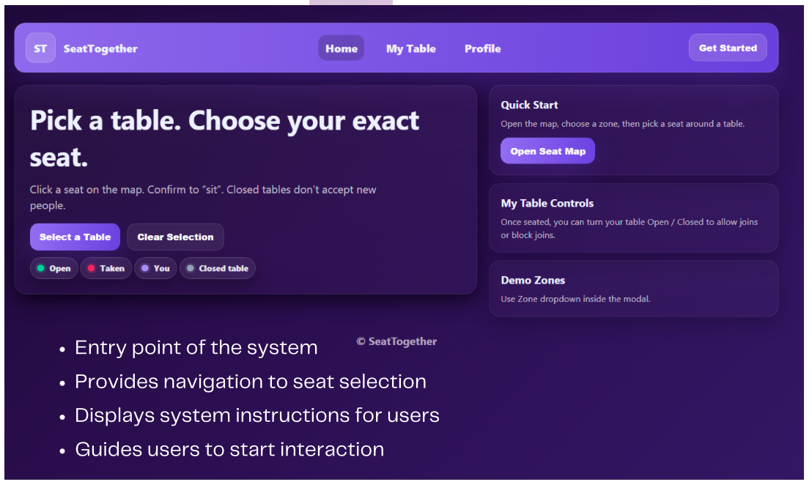
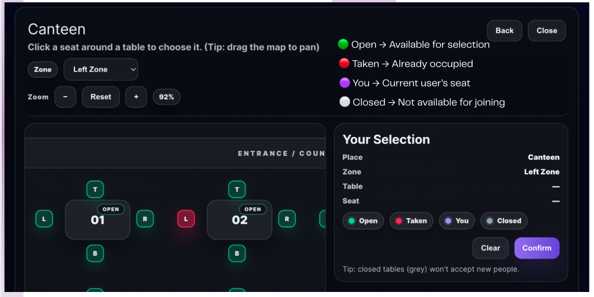
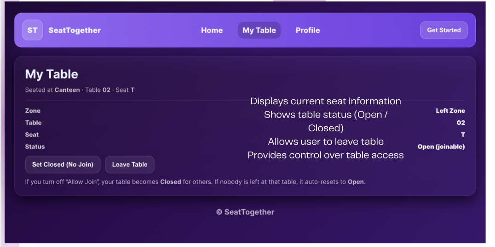

# SeatTogether

> A cloud-hosted smart seat selection and sharing platform designed to reduce canteen crowding, optimize seat usage, and make sharing dining spaces effortless.

---

## Project Overview

SeatTogether addresses peak-hour canteen inefficiencies where seats remain empty because students hesitate or feel awkward asking strangers to join partially occupied tables. It provides seat status visibility, seat-level selection, and interactive table control to promote a welcoming campus environment.

This was a course project for CN392 (Cloud Computing).

---

## My Contribution

I worked mainly on the Supabase backend (PostgreSQL tables, queries and API integration for seat, table and user status), and also contributed to the frontend and the AWS Amplify deployment.

---

## Screenshots







<!-- Add cropped screenshots to the repo root and update the filenames. Do not include slides that show student IDs. -->

---

## Deployment

* **Source Repository:** [GitHub Repository](https://github.com/Vixtoe/SeatTogether)
* **Hosting:** Originally deployed on AWS Amplify with automatic deploys from the GitHub main branch, on free-tier / low-cost services. The hosted instance has since been taken down, so the live link is no longer available. See the screenshots above and "Run Locally" below.

---

## Key System Features

* **Interactive Seat Map:** Displays a visual layout across canteen zones with seat status indicators (Available, Selected, Occupied, Closed).
* **Seat-Level Selection:** Allows users to pick precise seats before occupying them.
* **Table Access Control (Open / Closed):** Table hosts can set a table to "Open to Join" or "Closed" to prevent awkward interactions.
* **Multi-Zone Navigation:** Supports pan and zoom across multiple zones of a large dining area.
* **User Table Dashboard:** Lets users check their current seat, see table status, and leave a table.
* **Seat State Transitions:** Seats move through controlled states (Available, Selected, Occupied) and reset when a user leaves.

---

## Tech Stack

* **Frontend:** HTML, CSS, JavaScript (static site) [confirm against the repo]
* **Backend and Database:** Supabase (PostgreSQL, API)
* **Hosting and CI/CD:** AWS Amplify with automatic deploys from the GitHub main branch

---

## Cloud Architecture

```text
[ Users (Web Browser) ]
          |
          v
 [ AWS Amplify Hosting ] --(Auto Deploy)-- [ GitHub Main Branch ]
          |
          v (HTTPS)
 [ Supabase Backend ]
  |-- PostgreSQL Database (Seat, Table, User Status)
  `-- Supabase API [and Realtime Sync: keep only if the code uses it]
```

---

## Limitations and Future Work

* No user authentication yet (student email login is planned).
* [Real-time updates: if the app refreshes on a timer or on user actions, say so here. If it uses Supabase Realtime subscriptions, delete this bullet.]
* Planned: admin dashboard, crowd analytics, multi-location support.

---

## Run Locally

```bash
git clone https://github.com/Vixtoe/SeatTogether.git
cd SeatTogether
[Open index.html in a browser, or the command you use to serve it]
```

The app needs a Supabase project. Add your own Supabase URL and anon key in [FILE NAME]. Do not commit real keys to the repository.
